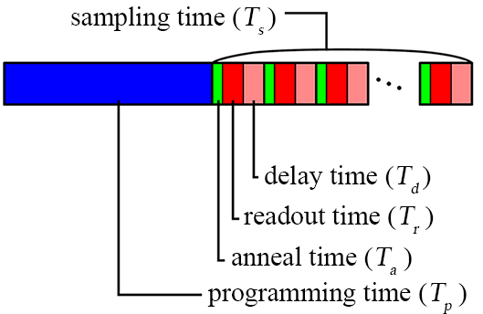

# Dwave-triangular
This is a illustration of dwave for triangular ising model
Hope you have a great day :blush:

## dwave prior work
*If virtualenv does not exist*
1. Create a new virtual environment of d-wave named quantum
    `python -m venv venv`
    
2. Enter the virtual environment
    - Macs
        `source venv/bin/activate` 
        
    - Windows
        `./venv/Scripts/activate.ps1` 
        
3. Confirmed the dwave-ocean sdk is not installed
    `pip uninstall dwave-ocean-sdk`
    
4. Update the pip install to the latest version
    `python -m pip install --upgrade pip`

## Requirements
`pip install -r ./requirements.txt`
or 
`pip install dwave-ocean-sdk` + `pip install fire`

## Usage
 - RunIsing: Execution with triangular ising model:
    ```sh
    python main.py runIsing -L [L] -JL [JL] -solver [solver] -numResult [nums]
    ``` 
    or 
    ```sh
    python main.py runIsing -L [L] -JL [JL] -s [solver] -n [nums]
    ```
    - format:   
        `-L`: length of the lattice
        `-JL`: bond strength connected between each nodes
        `-solver`: solver of D-wave: 
        - `exact` for exactSolver, 
        - `qpu`for quantum Solver

        `-numResult`: number of D-wave output results
    
    - usage examples:
        `python main.py runIsing -L 3 -JL 1.0 -solver exact -numResult 1` 
        or 
        `python main.py runIsing -L 3 -JL 1.0 -s exact -n 1`

 - RunSpaceFile: Execution with custom couplings
   ```sh
   python main.py runSpaceFile -filename [filename] -solver [solver] -numResult [num]
   ``` 
   or 
   ```sh
   python main.py runSpaceFile -f [filename] -s [solver] -n [num]
   ``` 
   - format:   
        `-filename`: input custon by space file 
        `-solver`: solver of D-wave: 
        - `exact` for D-wave exact solver, 
        - `qpu` for D-wave quantum Solver
        - `hybrid`: for D-wave hybrid solver

    `-numResult`: number of D-wave output results
    
   - usage examples:
        `python main.py runSpaceFile -f .\example\spaceExample.txt -s exact -n 1` 
    
## File Format (runSpacFile)
- Space Separate File Format
- using `#` as a comment for the model
```
# model_size
# it is a example of space bond file
1 1.0
0 0.5
0 1 0.5
0 2 0.7
2 3 0.5
1 2 0.8
2 1 0.6
```

## Notes: 
`dwave auth login --oob` for dwave auth login
`dwave auth get` for getting dwave auth tokens


### D-wave run results
#### Maple leaf Hybrid:
| L   | time       | energy   |
| --- | ---------- | -------- |
| 7   | 2.992 s    | -47.0    |
| 14  | 2.992 s    | -196.0   |
| 21  | 2.999 s    | -441.0   |
| 28  | 2.994 s    | -784.0   |
| 35  | 3.046 s    | -1225.0  |
| 42  | 4.097 s    | -1764.0  |
| 49  | 5.346 s    | -2401.0  |
| 56  | 6.792 s    | 3136.0   |
| 63  | 8.410 s    | -3969.0  |
| 70  | 10.519 s   | -4900.0  |
| 77  | 15.009 s   | -5929.0  |
| 84  | 19.919 s   | -7052.0  |
| 91  | 25.252 s   | -8277.0  |
| 98  | 31.005 s   | -9600.0  |
| 105 | 37.196 s   | -11023.0 |
| 112 | 46.016 s   | -12538.0 |
| 119 | 57.104 s   | -14153.0 |
| 126 | 1m 08.834s | -15868.0 |
| 133 | 1m 21.278s | -17681.0 |
| 140 | 1m 34.375s | -19588.0 |

#### Kagome Hybrid:
| L   | time     | energy  |
| --- | -------- | ------- |
| 6   | 2.985 s  | -18.0   |
| 12  | 2.996 s  | -72.0   |
| 18  | 2.999 s  | -162.0  |
| 24  | 2.990 s  | -288.0  |
| 30  | 2.989 s  | -450.0  |
| 36  | 3.000 s  | -648.0  |
| 42  | 3.671 s  | -882.0  |
| 48  | 4.585 s  | -1152.0 |
| 54  | 5.647 s  | -1458.0 |
| 60  | 6.810 s  | -1800.0 |
| 66  | 8.103 s  | -2178.0 |
| 72  | 9.521 s  | -2592.0 |
| 78  | 12.368 s | -3042.0 |
| 84  | 16.077 s | -3528.0 |
| 90  | 20.056 s | -4050.0 |
| 96  | 24.298 s | -4608.0 |
| 102 | 28.828 s | -5202.0 |
| 108 | 33.636 s | -5832.0 |
| 114 | 38.714 s | -6498.0 |
| 120 | 46.379 s | -7200.0 |

- QPU Access Time Detail
    - QPU Access time = Charge time
    - Detail of QPU access time
        

#### Maple Leaf QPU
- sample 3
| L   | time     | energy  |
| --- | -------- | ------- |
| 7   | 16.12 ms | -47.0   |
| 14  | 16.08 ms | -196.0  |
| 21  | 16.47 ms | -441.0  |
| 28  | 16.57 ms | -784.0  |
| 35  | 16.59 ms | -1225.0 |
| 42  | 16.59 ms | -1764.0 |

<!-- - sample 3
| L   | time     | energy  |
| --- | -------- | ------- |
| 7   | 16.12 ms | -47.0   |
| 14  | 16.08 ms | -196.0  |
| 21  | 16.47 ms | -441.0  |
| 28  | 16.57 ms | -784.0  |
| 35  | 16.59 ms | -1225.0 |
| 42  | 16.59 ms | -1764.0 | -->

#### Kagome QPU
- sample 3
| L   | time     | energy    | other solution          |
| --- | -------- | --------- | ----------------------- |
| 6   | 16.27 ms | -54.764   |                         |
| 12  | 16.33 ms | -343.488  |                         |
| 18  | 16.07 ms | -693.664  |                         |
| 24  | 16.43 ms | -1651.096 |                         |
| 30  | 16.49 ms | -2961.264 |                         |
| 36  | 16.57 ms | -3942.62  |                         |
| 42  | 16.58 ms | -6147.736 |                         |
| 48  | 16.59 ms | -8306.84  |                         |
| 54  | 16.60 ms | -8358.32  | -8352.664, -8348.674667 |
